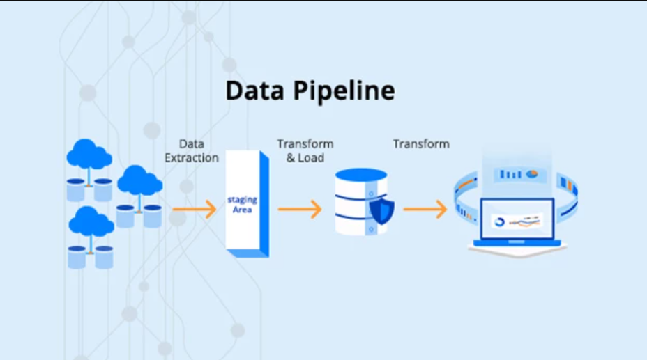

# How to use data pipeline module

## General information about the module
    - Overall; this is module is creating data piple. steps including
      data collection, cleaning, transformation and loading / storing into AWS S3
      is defined inside pipeline folder.

## Folder structure
    - .github/workflows: inside this folder/ directory, github actions pipeline is defined.
    - pipeline: this is the mean module code directory. you can define all the pipeline process inside this directory
    - venv_pipeline: this a virtual machine directory that can install all the dependencies related to the module
    - .gitignore: ignore all the directories / files that you don't want them to be pushed to github repo
    - .pre-commit-config.yaml: this file contains the configurations of pre-commit module
    - README.md: this contains docs about the module
    - requirements.txt: this contains all the requiremtns of the module

## How use
1. download the repo
    - git clone https://github.com/zamanrahimi/data-pipeline-with-python.git

2. activate the virtual environment
- create: python -m venv venv_pipeline
- activiate:
    - mac/linux: source venv_pipeline/bin/activate
    - windows: venv_pipeline\Scripts\activate

3. install the module requirements
    - pip install -r requirements.txt

4. install pre-commit
    - pre-commit install

5. write your code inside pipeline directory
